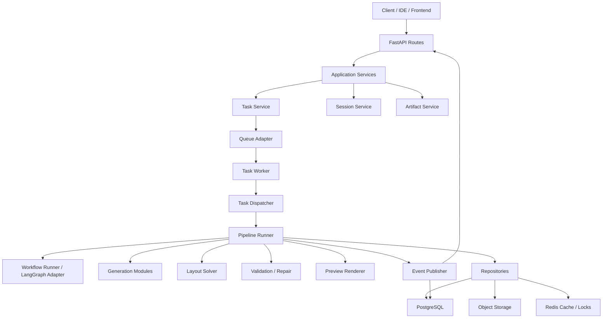
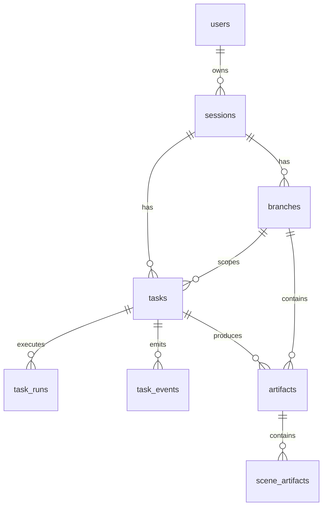

# 后端重构详细设计文档

## 1. 文档定位

本文档用于指导 `blog-2-video` 后端后续开发落地，承接以下文档：

- `video-back/doc/backend-rearchitecture-plan.md`
- `video-back/doc/backend-rearchitecture-prd.md`

PRD 说明“要做什么”和“为什么要做”，本文档说明“怎么做”、“代码怎么拆”、“数据怎么流转”、“每一期开发按什么边界推进”。

## 2. 设计目标

本次后端重构要从当前以 LangGraph workflow 为中心的原型，逐步演进为：

```text
API
-> Task System
-> Pipeline / Workflow Runner
-> Generation / Layout / Validation / Repair / Rendering
-> Artifact Store / Event Store
-> Timeline / Branch / Scene Version
```

核心目标：

- `session` 成为创作上下文。
- `task` 成为执行单元。
- `artifact` 成为事实来源。
- `scene_artifact` 成为 scene 级编辑、重生成、修复、回滚的最小业务对象。
- `task_event` 成为前端进度、时间线和调试信息的统一来源。
- `LangGraph checkpoint` 降级为 workflow 内部恢复机制。
- `layout validator + repair` 成为画面稳定性的程序级保障。
- `style router + primitive library` 成为视觉质量上限的结构化保障。

非目标：

- 不要求一次性替换现有 `/api/generate_animation_sse`。
- 不要求首期完成完整权限、TTS、字幕、素材版权和最终视频导出。
- 不要求首期接入真实渲染 worker，但必须预留接口。

## 3. 当前代码基线

当前 `video-back` 主要模块：

```text
video-back/
  agents/
    coder.py
    content_reviewer.py
    content_writer.py
    director.py
    qa_guard.py
    visual_architect.py
  api/
    routes.py
    schemas.py
  models/
    get_model.py
  prompts/
    *.yaml
    manager.py
  services/
    scene_service.py
    workflow_service.py
  utils/
    cache.py
    logger.py
    persistent_checkpointer.py
    structured_output.py
  workflow/
    animation_work_flow.py
    conversational_tone_work_flow.py
    runtime.py
```

当前动画链路：

```text
director_node
-> visual_architect_node
-> coder_node per scene
-> qa_guard_check
```

当前主要问题：

- `workflow/animation_work_flow.py` 的 `State` 是 workflow 内部状态，不是产品级状态。
- `coder` 结果是列表聚合，不是可独立版本化的 `scene_artifact`。
- `failed_scenes` 只记录失败 scene id，缺少结构化 validation report。
- `last_action` 只能展示进度文案，不能替代事件流。
- `workflow/runtime.py` 使用 `InMemorySaver`，不能作为业务历史事实来源。
- `.cache/{hash}.json` 只能作为性能缓存，不能作为 artifact 或长期事实来源。

需要兼容的旧 API：

```text
GET  /api/workflows
GET  /api/workflows/{workflow_name}/history
POST /api/workflows/{workflow_name}/replay_sse
POST /api/workflows/{workflow_name}/fork_sse
POST /api/workflows/animation/regenerate_scene_sse
POST /api/generate_script_sse
POST /api/generate_animation_sse
```

迁移原则：

- 短期保留旧 API。
- 新 API 不直接暴露 workflow checkpoint。
- 旧 API 可逐步包装成新 task system 的兼容入口。
- 前端最终应从 `workflow history` 切换到 `session timeline`。

## 4. 目标架构



分层职责：

| 层 | 职责 | 不做什么 |
| --- | --- | --- |
| API | 参数校验、鉴权占位、调用应用服务、SSE 输出 | 不直接跑 LangGraph |
| Application Service | 编排创建 session、创建 task、查询 timeline 等用例 | 不写 SQL 细节 |
| Domain | 业务对象、状态机、领域规则 | 不依赖 FastAPI |
| Orchestration | task 调度、pipeline 选择、workflow 适配、事件发布 | 不定义业务表结构 |
| Generation | LLM agent 调用、prompt profile、结构化输出 | 不决定最终几何正确性 |
| Layout | primitive、文本测量、布局求解、几何校验、修复 | 不直接调用 LLM |
| Rendering | 预览渲染、截图、视觉验收 | 不保存业务主数据 |
| Persistence | 数据模型、repository、事务 | 不包含生成逻辑 |
| Infra | DB、Redis、队列、对象存储、日志、配置 | 不包含业务规则 |

## 5. 目标目录设计

建议逐步演进到以下结构：

```text
video-back/
  api/
    routes/
      sessions.py
      tasks.py
      artifacts.py
      workflow_compat.py
    schemas/
      common.py
      sessions.py
      tasks.py
      artifacts.py
      events.py
    router.py
  app/
    config.py
    dependencies.py
    errors.py
  domain/
    common/
      ids.py
      enums.py
      errors.py
    sessions/
      entities.py
      service.py
    tasks/
      entities.py
      state_machine.py
      service.py
    artifacts/
      entities.py
      service.py
    scenes/
      entities.py
      service.py
  orchestration/
    task_dispatcher.py
    task_runner.py
    workflow_runner.py
    event_publisher.py
    task_context.py
  pipelines/
    base.py
    create_video.py
    regenerate_scene.py
    repair_scene.py
    render_preview.py
  generation/
    storyboard/
      planner.py
    style_router/
      router.py
      profiles.py
    scene_intent/
      generator.py
    codegen/
      primitive_codegen.py
  layout/
    canvas.py
    primitives.py
    text_metrics.py
    solver.py
    validator.py
    repair.py
    schemas.py
  rendering/
    preview_renderer.py
    visual_validator.py
    schemas.py
  persistence/
    db.py
    models/
    repositories/
    migrations/
  infra/
    cache/
    queue/
    storage/
    locks/
  workers/
    task_worker.py
    render_worker.py
```

迁移要求：

- 第一阶段不强制移动所有旧文件。
- `workflow/animation_work_flow.py` 暂时保留，通过 `WorkflowRunner` 包装。
- `api/routes.py` 可保留兼容入口，新 API 逐步拆到 `api/routes/`。
- 新业务模型先独立实现，不要强行把旧 workflow state 改成最终形态。
- 每引入一个新领域对象，都要补 repository 和测试。

## 6. 领域模型设计

### 6.1 ID 规范

统一使用带前缀字符串 ID，便于日志和排查：

| 对象 | ID 前缀 | 示例 |
| --- | --- | --- |
| Session | `sess_` | `sess_01hz...` |
| Branch | `br_` | `br_01hz...` |
| Task | `task_` | `task_01hz...` |
| TaskRun | `run_` | `run_01hz...` |
| Event | `evt_` | `evt_01hz...` |
| Artifact | `art_` | `art_01hz...` |
| SceneArtifact | `scnart_` | `scnart_01hz...` |
| RenderJob | `render_` | `render_01hz...` |

首版可使用 `uuid4`，后续可替换为 ULID。

### 6.2 核心枚举

```python
class SessionStatus(str, Enum):
    ACTIVE = "active"
    ARCHIVED = "archived"
    ERROR = "error"

class TaskStatus(str, Enum):
    PENDING = "pending"
    QUEUED = "queued"
    RUNNING = "running"
    SUCCEEDED = "succeeded"
    FAILED = "failed"
    CANCELLED = "cancelled"
    RETRYING = "retrying"
    BLOCKED = "blocked"

class TaskType(str, Enum):
    CREATE_VIDEO = "create_video"
    REGENERATE_SCENE = "regenerate_scene"
    REPAIR_SCENE = "repair_scene"
    RENDER_PREVIEW = "render_preview"

class ArtifactType(str, Enum):
    SOURCE_DOCUMENT = "source_document"
    SCRIPT = "script"
    STORYBOARD = "storyboard"
    VISUAL_STRATEGY = "visual_strategy"
    SCENE_INTENT_BUNDLE = "scene_intent_bundle"
    SCENE_LAYOUT_BUNDLE = "scene_layout_bundle"
    SCENE_CODE_BUNDLE = "scene_code_bundle"
    VALIDATION_REPORT = "validation_report"
    REPAIR_REPORT = "repair_report"
    PREVIEW_IMAGE = "preview_image"
```

### 6.3 Task 状态机

```text
pending -> queued -> running -> succeeded
pending -> queued -> running -> failed
pending -> queued -> running -> cancelled
pending -> queued -> running -> blocked
failed -> retrying -> queued
```

状态规则：

- 只有 `pending` 可以进入 `queued`。
- 只有 `queued` 可以进入 `running`。
- 只有 `running` 可以进入 `succeeded`、`failed`、`cancelled`、`blocked`。
- `failed` 可以进入 `retrying`，再进入 `queued`。
- `succeeded` 是终态，不允许重开同一个 task；需要创建新 task。
- `cancelled` 是终态。

### 6.4 Artifact 版本规则

artifact 版本按 `session_id + branch_id + artifact_type + artifact_subtype` 自增。

规则：

- 同一 branch 下同类型 artifact 新发布时版本号递增。
- repair 不覆盖旧 artifact，而是生成新 artifact，并设置 `parent_artifact_id`。
- `branch.head_artifact_id` 只指向当前 branch 的最新可消费主产物。
- scene artifact 的版本按 `session_id + branch_id + scene_id` 自增。

## 7. 数据库设计

### 7.1 表关系



### 7.2 最小表集合

首期需要以下表：

- `users`
- `sessions`
- `branches`
- `tasks`
- `task_runs`
- `task_events`
- `artifacts`
- `scene_artifacts`
- `render_jobs`

增强表：

- `task_locks`
- `prompt_profiles`
- `theme_profiles`
- `asset_references`
- `quality_scores`
- `usage_metrics`

### 7.3 关键表字段

`sessions`：

```text
id
user_id
title
source_type
source_content
status
current_branch_id
created_at
updated_at
```

`branches`：

```text
id
session_id
parent_branch_id
base_artifact_id
name
head_artifact_id
version
created_from_task_id
created_at
```

`tasks`：

```text
id
session_id
branch_id
task_type
status
priority
requested_by
request_payload
baseline_artifact_id
result_summary
error_code
error_message
created_at
started_at
finished_at
```

`task_events`：

```text
id
task_id
task_run_id
session_id
branch_id
scene_id
event_type
event_level
node_key
payload
created_at
```

`artifacts`：

```text
id
session_id
branch_id
task_id
artifact_type
artifact_subtype
version
content_json
content_text
storage_url
summary
parent_artifact_id
created_at
```

`scene_artifacts`：

```text
id
artifact_id
session_id
branch_id
scene_id
scene_order
scene_type
script_text
visual_intent
layout_spec
code_text
validation_report
preview_image_url
status
version
created_at
```

### 7.4 推荐索引

```sql
CREATE INDEX idx_sessions_user_updated ON sessions(user_id, updated_at DESC);
CREATE INDEX idx_branches_session ON branches(session_id, created_at DESC);
CREATE INDEX idx_tasks_session_created ON tasks(session_id, created_at DESC);
CREATE INDEX idx_tasks_branch_status ON tasks(branch_id, status);
CREATE INDEX idx_tasks_status_priority ON tasks(status, priority, created_at);
CREATE INDEX idx_task_events_task_created ON task_events(task_id, created_at);
CREATE INDEX idx_task_events_session_created ON task_events(session_id, created_at DESC);
CREATE INDEX idx_artifacts_branch_type_version
  ON artifacts(branch_id, artifact_type, artifact_subtype, version DESC);
CREATE INDEX idx_scene_artifacts_scene_version
  ON scene_artifacts(session_id, branch_id, scene_id, version DESC);
```

## 8. Repository 设计

Repository 原则：

- API 和 pipeline 不直接操作数据库模型。
- Repository 方法只处理持久化，不做复杂业务决策。
- 同一个业务动作需要多个写入时，由 application service 或 unit of work 管事务。
- 事件写入与 artifact 发布尽量同事务提交。

核心接口：

```python
class SessionRepository(Protocol):
    async def create(self, session: SessionRecord) -> SessionRecord: ...
    async def get(self, session_id: str, user_id: str | None = None) -> SessionRecord | None: ...
    async def set_current_branch(self, session_id: str, branch_id: str) -> None: ...

class BranchRepository(Protocol):
    async def create(self, branch: BranchRecord) -> BranchRecord: ...
    async def get(self, branch_id: str) -> BranchRecord | None: ...
    async def list_by_session(self, session_id: str) -> list[BranchRecord]: ...
    async def update_head(self, branch_id: str, expected_version: int, head_artifact_id: str) -> bool: ...

class TaskRepository(Protocol):
    async def create(self, task: TaskRecord) -> TaskRecord: ...
    async def get(self, task_id: str) -> TaskRecord | None: ...
    async def transition(self, task_id: str, from_status: str, to_status: str, **fields) -> bool: ...
    async def append_run(self, run: TaskRunRecord) -> TaskRunRecord: ...

class EventRepository(Protocol):
    async def append(self, event: TaskEventRecord) -> TaskEventRecord: ...
    async def list_by_task(self, task_id: str, after_id: str | None = None) -> list[TaskEventRecord]: ...
    async def list_timeline(self, session_id: str, branch_id: str | None = None, limit: int = 100) -> list[TaskEventRecord]: ...

class ArtifactRepository(Protocol):
    async def publish(self, artifact: ArtifactRecord) -> ArtifactRecord: ...
    async def get(self, artifact_id: str) -> ArtifactRecord | None: ...
    async def latest(self, branch_id: str, artifact_type: str, artifact_subtype: str | None = None) -> ArtifactRecord | None: ...
    async def next_version(self, branch_id: str, artifact_type: str, artifact_subtype: str | None = None) -> int: ...
```

## 9. API 设计

### 9.1 路由拆分

```text
api/routes/sessions.py
api/routes/tasks.py
api/routes/artifacts.py
api/routes/workflow_compat.py
```

### 9.2 Session API

`POST /api/sessions`

请求：

```json
{
  "source_type": "text",
  "source_content": "原文内容",
  "title": "可选标题",
  "user_preference": {
    "style_family": null,
    "duration_seconds": null
  }
}
```

响应：

```json
{
  "session_id": "sess_xxx",
  "branch_id": "br_xxx",
  "status": "active"
}
```

处理流程：

```text
validate request
-> create session
-> create default branch
-> create source_document artifact
-> return session_id and branch_id
```

`GET /api/sessions/{session_id}` 返回 session 概览。

`GET /api/sessions/{session_id}/timeline` 返回 session 时间线。

### 9.3 Task API

`POST /api/sessions/{session_id}/tasks`

请求：

```json
{
  "branch_id": "br_xxx",
  "task_type": "create_video",
  "request_payload": {
    "source_artifact_id": "art_xxx"
  },
  "baseline_artifact_id": null
}
```

响应：

```json
{
  "task_id": "task_xxx",
  "status": "queued"
}
```

处理流程：

```text
validate session and branch
-> check baseline artifact
-> create task pending
-> append task.created
-> enqueue task
-> transition pending -> queued
-> append task.queued
-> return task id
```

其他接口：

- `GET /api/tasks/{task_id}`
- `GET /api/tasks/{task_id}/events`
- `GET /api/tasks/{task_id}/events_sse`
- `POST /api/tasks/{task_id}/cancel`
- `POST /api/tasks/{task_id}/retry`

### 9.4 Artifact API

接口：

- `GET /api/artifacts/{artifact_id}`
- `GET /api/scene-artifacts/{scene_artifact_id}`
- `POST /api/artifacts/{artifact_id}/branch`
- `GET /api/branches/{branch_id}/artifacts`

从 artifact 创建 branch 的处理流程：

```text
load artifact
-> create branch with base_artifact_id
-> set parent_branch_id from artifact.branch_id
-> append branch.created event
-> return new branch
```

### 9.5 兼容旧 API

保留旧入口：

- `/api/generate_script_sse`
- `/api/generate_animation_sse`
- `/api/workflows/{workflow_name}/history`
- `/api/workflows/{workflow_name}/replay_sse`
- `/api/workflows/{workflow_name}/fork_sse`
- `/api/workflows/animation/regenerate_scene_sse`

后续适配策略：

```text
/api/generate_animation_sse
-> create session if no session_id
-> create task create_video
-> stream task events
```

短期如果前端仍依赖旧 payload：

- `TaskEvent` 转成 legacy SSE payload。
- 保留 `type: progress/updates/end/error`。

## 10. Task System 设计

### 10.1 队列策略

首版建议支持两种 queue adapter：

```text
InlineQueue
  用于本地开发和测试

RedisQueue / RQQueue
  用于后续多 worker
```

接口：

```python
class TaskQueue(Protocol):
    async def enqueue(self, task_id: str, priority: int = 100) -> None: ...
    async def dequeue(self) -> str | None: ...
```

如果首期不接 Redis，也可以由 API 创建 task 后用后台任务执行，但必须保留 queue adapter 接口，避免后续重写。

### 10.2 TaskWorker

```python
class TaskWorker:
    async def run_forever(self) -> None:
        while True:
            task_id = await self.queue.dequeue()
            if not task_id:
                await asyncio.sleep(1)
                continue
            await self.runner.run(task_id)
```

### 10.3 TaskRunner

职责：

- 加载 task。
- 校验状态。
- 创建 task_run。
- 切换 task 状态。
- 调用 dispatcher。
- 捕获异常并写入 event。
- 在 stage 边界检查 cancel。

伪代码：

```python
async def run(self, task_id: str) -> None:
    task = await task_repo.get(task_id)
    await task_repo.transition(task.id, "queued", "running", started_at=now())
    run = await task_repo.append_run(...)
    await event_publisher.publish("task.started", task, run)

    try:
        pipeline = dispatcher.resolve(task.task_type)
        result = await pipeline.run(TaskContext(task=task, run=run))
        await task_repo.transition(task.id, "running", "succeeded", result_summary=result.summary)
        await event_publisher.publish("task.completed", task, run, result.summary)
    except CancelledError:
        await task_repo.transition(task.id, "running", "cancelled")
        await event_publisher.publish("task.cancelled", task, run)
    except Exception as exc:
        await task_repo.transition(task.id, "running", "failed", error_message=str(exc))
        await event_publisher.publish("task.failed", task, run, {"message": str(exc)})
```

### 10.4 TaskDispatcher

映射关系：

| task_type | pipeline |
| --- | --- |
| `create_video` | `CreateVideoPipeline` |
| `rewrite_script` | `ScriptRewritePipeline` |
| `generate_storyboard` | `StoryboardPipeline` |
| `generate_visual_strategy` | `VisualStrategyPipeline` |
| `regenerate_scene` | `RegenerateScenePipeline` |
| `repair_scene` | `RepairScenePipeline` |
| `render_preview` | `RenderPreviewPipeline` |

## 11. Pipeline 设计

### 11.1 Pipeline 接口

```python
class Pipeline(Protocol):
    name: str

    async def run(self, context: TaskContext) -> PipelineResult:
        ...
```

`TaskContext`：

```python
class TaskContext(BaseModel):
    task_id: str
    task_run_id: str
    session_id: str
    branch_id: str
    user_id: str
    request_payload: dict[str, Any]
    baseline_artifact_id: str | None
    cancellation_token: CancellationToken
```

`PipelineResult`：

```python
class PipelineResult(BaseModel):
    summary: dict[str, Any] = {}
    artifact_ids: list[str] = []
    scene_artifact_ids: list[str] = []
```

### 11.2 Stage 输出协议

每个 stage 要返回统一结构：

```python
class StageResult(BaseModel):
    stage_name: str
    artifact_type: str | None = None
    artifact_subtype: str | None = None
    content_json: dict[str, Any] | None = None
    content_text: str | None = None
    storage_url: str | None = None
    summary: str | None = None
    scene_artifacts: list[SceneArtifactDraft] = []
```

### 11.3 CreateVideoPipeline

目标链路：

```text
source_document
-> script
-> storyboard
-> visual_strategy
-> scene_intent_bundle
-> scene_layout_bundle
-> scene_code_bundle
-> validation_report
-> optional preview_image
```

伪代码：

```python
async def run(context):
    source = await artifact_repo.get(context.request_payload["source_artifact_id"])

    script = await script_rewriter.run(source)
    script_artifact = await artifact_service.publish(...)

    storyboard = await storyboard_planner.run(script)
    storyboard_artifact = await artifact_service.publish(...)

    visual_strategy = await style_router.run(storyboard)
    visual_strategy_artifact = await artifact_service.publish(...)

    intents = await scene_intent_generator.run(storyboard, visual_strategy)
    layouts = await layout_solver.solve_many(intents, visual_strategy)
    validation = await layout_validator.validate_many(layouts)

    if validation.has_blocking_errors:
        layouts = await repair_service.repair_layouts(layouts, validation)

    code_bundle = await codegen.run(layouts, visual_strategy)
    code_artifact = await artifact_service.publish(...)

    return PipelineResult(...)
```

### 11.4 RegenerateScenePipeline

输入：

- `scene_id`
- `base_scene_artifact_id`
- `script_text` 可选。
- `visual_design` 或 `user_instruction` 可选。

流程：

```text
load base scene artifact
-> load branch visual_strategy
-> generate scene intent
-> solve layout
-> generate code
-> validate
-> repair if needed
-> publish new scene artifact version
-> publish bundle artifact if needed
```

约束：

- 不修改其他 scene。
- 必须检查 baseline 是否过期。
- 如果同 scene 有其他 running regenerate task，返回冲突或排队。

### 11.5 RepairScenePipeline

输入：

- `scene_artifact_id`
- `validation_report_id`
- `repair_policy`

流程：

```text
load scene artifact
-> load validation report
-> apply lowest-cost repair
-> validate again
-> publish repaired scene artifact
-> publish repair_report
```

repair 策略：

- `layout_only`
- `text_split`
- `primitive_swap`
- `regenerate_intent`
- `regenerate_scene`

## 12. WorkflowRunner 设计

### 12.1 定位

`WorkflowRunner` 是旧 LangGraph workflow 和新 task system 之间的适配层。

职责：

- 将 `TaskContext` 转成现有 workflow initial state。
- 执行 `workflow.astream(...)`。
- 将 workflow updates 转成标准 `TaskEvent`。
- 将最终 state 转成 artifact draft。

### 12.2 接口

```python
class WorkflowRunner:
    async def run_animation(self, context: TaskContext, script: str) -> WorkflowRunResult:
        ...
```

### 12.3 事件映射

| 当前 update | 标准事件 |
| --- | --- |
| setup | `task.progress` |
| `director_node` completed | `workflow.node_completed` + `artifact.published: storyboard` |
| `visual_architect_node` completed | `workflow.node_completed` + `artifact.published: visual_strategy` |
| `coder_node` completed | `workflow.node_completed` + `artifact.published: scene_code_bundle` |
| error | `task.failed` |
| end | `task.completed` |

### 12.4 checkpoint thread_id 设计

checkpoint `thread_id` 不再由前端直接传入，而由 task system 生成：

```text
thread_id = task_id
```

或：

```text
thread_id = f"{session_id}:{branch_id}:{task_id}"
```

推荐首版使用 `task_id`，便于定位。

## 13. ArtifactService 设计

### 13.1 发布 artifact

```python
async def publish_artifact(
    session_id: str,
    branch_id: str,
    task_id: str,
    artifact_type: ArtifactType,
    content_json: dict | None = None,
    content_text: str | None = None,
    storage_url: str | None = None,
    parent_artifact_id: str | None = None,
) -> ArtifactRecord:
    version = await artifact_repo.next_version(branch_id, artifact_type)
    artifact = ArtifactRecord(...)
    return await artifact_repo.publish(artifact)
```

### 13.2 发布 scene artifacts

```python
async def publish_scene_artifacts(
    bundle_artifact: ArtifactRecord,
    scene_drafts: list[SceneArtifactDraft],
) -> list[SceneArtifactRecord]:
    ...
```

### 13.3 事务边界

推荐将以下操作放入同一事务：

```text
insert artifact
insert scene_artifacts
insert task_event artifact.published
update branch head if artifact is head candidate
```

如果对象存储上传失败，不应插入 artifact。

如果数据库插入失败，已上传对象需要标记清理，或使用临时路径后再 promote。

## 14. EventPublisher 设计

### 14.1 接口

```python
class EventPublisher:
    async def publish(
        self,
        event_type: str,
        *,
        task_id: str,
        task_run_id: str | None,
        session_id: str,
        branch_id: str,
        scene_id: str | None = None,
        event_level: str = "info",
        node_key: str | None = None,
        payload: dict[str, Any] | None = None,
    ) -> TaskEventRecord:
        ...
```

### 14.2 发布策略

首版：

- 写入 `task_events` 表。
- SSE 轮询或长连接读取新增 event。

后续：

- 写入 DB 后同时 publish 到 Redis pub/sub。
- SSE 订阅 Redis channel，断线后从 DB 补历史。

### 14.3 事件 payload 规范

`task.progress`：

```json
{
  "node_key": "visual_architect_node",
  "label": "正在设计视觉方案",
  "percent": 45,
  "completed_count": 2,
  "total_count": 5
}
```

`artifact.published`：

```json
{
  "artifact_id": "art_xxx",
  "artifact_type": "visual_strategy",
  "version": 1,
  "summary": "生成全局视觉策略"
}
```

`validation.failed`：

```json
{
  "artifact_id": "art_xxx",
  "scene_id": "scene_001",
  "error_count": 2,
  "blocking": true,
  "errors": [
    {
      "code": "TEXT_OVERFLOW",
      "severity": "error",
      "target_path": "layout.elements[2]",
      "message": "文本容器高度不足",
      "repair_hint": "increase_container_height"
    }
  ]
}
```

## 15. Layout 子系统设计

### 15.1 核心数据结构

```python
class CanvasSpec(BaseModel):
    width: int = 1080
    height: int = 1920
    safe_top: int = 96
    safe_right: int = 72
    safe_bottom: int = 120
    safe_left: int = 72

class PrimitiveIntent(BaseModel):
    id: str
    role: str
    primitive_type: str
    importance: int
    text: str | None = None
    preferred_region: str | None = None
    group_with: list[str] = []
    must_follow: list[str] = []

class LayoutBox(BaseModel):
    x: float
    y: float
    width: float
    height: float
    rotation: float = 0
    z_index: int = 0

class LayoutElement(BaseModel):
    id: str
    primitive_type: str
    role: str
    box: LayoutBox
    style: dict[str, Any] = {}
    content: dict[str, Any] = {}
    reveal_order: int | None = None

class SceneLayoutSpec(BaseModel):
    scene_id: str
    canvas: CanvasSpec
    elements: list[LayoutElement]
```

### 15.2 PrimitiveSpec

```python
class PrimitiveSpec(BaseModel):
    primitive_type: str
    min_width: int
    min_height: int
    max_text_lines: int | None = None
    min_font_size: int = 28
    default_padding: int = 24
    allow_rotation: bool = False
    can_overlap: bool = False
    allowed_roles: list[str]
```

首批 primitive：

| primitive | 用途 | 首版布局约束 |
| --- | --- | --- |
| `HeroTitle` | 强标题 | 大字号，优先上/中区域，不允许旋转 |
| `BodyCard` | 正文卡片 | 最多 3 行，允许下方区域 |
| `QuoteCard` | 引用 | 需要较大留白 |
| `StatPanel` | 单指标 | 数字优先，文字辅助 |
| `MetricGrid` | 多指标 | 网格布局 |
| `StepTimeline` | 步骤流程 | 垂直或水平时间线 |
| `ComparisonSplit` | 对比 | 左右或上下分区 |
| `ScreenshotFrame` | 截图 | 固定宽高比 |
| `ChartCard` | 图表 | 需要图表区域和标题区域 |
| `TerminalSnippet` | 代码/命令 | 等宽字体，最多若干行 |
| `ImageStage` | 图片主体 | 优先大面积展示 |
| `CalloutTag` | 辅助标注 | 不主导布局 |

### 15.3 TextMetrics

首版采用估算，不依赖浏览器渲染：

```python
class TextMetrics:
    def estimate_lines(self, text: str, font_size: int, width: int, font_family: str) -> int:
        ...

    def estimate_height(self, text: str, font_size: int, line_height: float, width: int) -> int:
        ...
```

估算规则：

- 中文字符宽度约 `font_size`。
- 英文字符平均宽度约 `font_size * 0.55`。
- 数字约 `font_size * 0.56`。
- 空格约 `font_size * 0.33`。
- 长英文 token 超出宽度时按硬换行计算。

后续可升级为 PIL / fonttools 真实测量，或浏览器截图后二次校验。

### 15.4 LayoutSolver 第一版算法

第一版采用规则求解：

```text
输入 scene_intent, theme_profile, primitive_specs, canvas
-> 按 importance 排序
-> 根据 scene_type 选择布局模板
-> 分配区域
-> 为每个 primitive 估算最小尺寸
-> 放置元素
-> 文本高度估算
-> 检测越界和碰撞
-> 如果失败，降级策略重排
-> 输出 layout_spec
```

scene type 到模板：

| scene_type | layout template |
| --- | --- |
| `statement` | hero title + supporting body |
| `contrast` | comparison split |
| `process` | step timeline |
| `timeline` | vertical timeline |
| `data_point` | stat panel + explanation |
| `product_demo` | screenshot frame + callouts |
| `quote` | quote card + attribution |
| `emotion_peak` | hero title + image stage |

### 15.5 LayoutValidator

```python
class ValidationIssue(BaseModel):
    code: str
    severity: Literal["info", "warning", "error"]
    scene_id: str
    element_id: str | None = None
    target_path: str
    message: str
    repair_hint: str | None = None

class ValidationReport(BaseModel):
    scene_id: str
    passed: bool
    issues: list[ValidationIssue]
```

检查项：

- `SAFE_AREA_OVERFLOW`
- `BBOX_OVERFLOW`
- `ROTATED_BBOX_OVERFLOW`
- `TEXT_OVERFLOW`
- `ELEMENT_COLLISION`
- `ZINDEX_REVEAL_MISMATCH`
- `FONT_SIZE_TOO_SMALL`
- `UNSUPPORTED_PRIMITIVE`

### 15.6 RepairService

repair 优先级：

```text
TEXT_OVERFLOW
  -> expand container
  -> reduce font size within limit
  -> split text into multiple cards
  -> request regenerate intent

BBOX_OVERFLOW
  -> move into safe area
  -> shrink decorative elements
  -> reduce rotation
  -> reflow layout template

ELEMENT_COLLISION
  -> increase spacing
  -> move lower-priority element
  -> stack vertically
  -> remove decorative callout
```

repair 输出：

```python
class RepairResult(BaseModel):
    repaired: bool
    repaired_layout_spec: SceneLayoutSpec | None
    repair_report: dict[str, Any]
    remaining_issues: list[ValidationIssue]
```

## 16. 视觉策略系统设计

### 16.1 StyleRouter

输入：

- storyboard。
- scene type。
- 用户偏好。
- 内容类型。

输出：

```python
class VisualStrategy(BaseModel):
    style_family: str
    theme_profile: ThemeProfile
    motion_profile: MotionProfile
    asset_policy: AssetPolicy
    scene_type_mapping: dict[str, SceneVisualPolicy]
```

### 16.2 ThemeProfile

```python
class ThemeProfile(BaseModel):
    theme_id: str
    name: str
    font_heading: str
    font_body: str
    color_background: str
    color_primary: str
    color_secondary: str
    color_text: str
    surface_style: str
    corner_radius_scale: str
    shadow_style: str
    stroke_style: str
    motion_style: str
```

### 16.3 SceneVisualPolicy

```python
class SceneVisualPolicy(BaseModel):
    scene_type: str
    allowed_primitives: list[str]
    preferred_composition: str
    max_density: str
    asset_policy: dict[str, Any]
```

### 16.4 首版实现建议

第一版不一定需要新的 LLM agent，可以先做规则路由：

```text
if scene_type == "data_point":
  style_family = "diagrammatic_minimal"
  primitives = ["StatPanel", "BodyCard", "CalloutTag"]

if scene_type == "product_demo":
  style_family = "product_ui"
  primitives = ["ScreenshotFrame", "CalloutTag", "HeroTitle"]

if scene_type == "quote":
  style_family = "editorial_typography"
  primitives = ["QuoteCard", "HeroTitle"]
```

后续再引入 LLM 生成 `visual_strategy`，但输出必须通过 schema 校验。

## 17. Codegen 设计

### 17.1 目标

减少 coder 从零即兴生成 UI 结构，让 coder 或程序主要完成：

```text
layout_spec + primitive + theme_profile + motion_profile
-> Remotion component code
```

### 17.2 输出协议

```python
class SceneCodeResult(BaseModel):
    scene_id: str
    code: str
    imports: list[str] = []
    exports: list[str] = []
    used_primitives: list[str] = []
```

### 17.3 分阶段策略

阶段一：

- 仍使用现有 `agents/coder.py`。
- prompt 输入从自由视觉描述改为 `layout_spec` 和 `visual_strategy`。
- 输出仍是结构化 `CoderResult`。

阶段二：

- 引入 `generation/codegen/primitive_codegen.py`。
- 常见 primitive 由模板生成。
- LLM 只处理复杂内容或样式细节。

阶段三：

- 大部分 scene code 从受控模板生成。
- LLM 只生成少量 creative config。

## 18. Rendering 设计

### 18.1 PreviewRenderer

接口：

```python
class PreviewRenderer(Protocol):
    async def render_scene_preview(
        self,
        scene_code: str,
        scene_id: str,
        frame: int = 0,
    ) -> RenderResult:
        ...
```

`RenderResult`：

```python
class RenderResult(BaseModel):
    scene_id: str
    storage_url: str
    width: int
    height: int
    frame: int
    metadata: dict[str, Any] = {}
```

### 18.2 首版策略

M1 可不接真实渲染，只保留接口。

M4 接入：

- render worker。
- 本地 Remotion CLI。
- 截图保存到对象存储。
- `preview_image` artifact。

### 18.3 VisualValidator

首版规则：

- 是否存在预览图。
- 图片尺寸是否符合目标画布。
- 后续接入 OCR 检查文字是否被裁切。

后续增强：

- 视觉模型评估文字可读性。
- 检查 UI 是否过度空洞或拥挤。
- 检查是否偏离 theme profile。

## 19. 缓存设计

### 19.1 CacheKey

```python
class CacheKeyParts(BaseModel):
    model_role: str
    prompt_version: str
    session_id: str | None = None
    branch_id: str | None = None
    scene_id: str | None = None
    input_hash: str
```

key 格式：

```text
{model_role}:{prompt_version}:{session_id}:{branch_id}:{scene_id}:{input_hash}
```

最终存储前再 sha256。

### 19.2 缓存与 artifact 的关系

- cache 是性能优化，不是事实来源。
- artifact 是产品结果，必须可追溯。
- scene code、validation report、repair result 必须入 artifact。
- cache 命中后仍要把本次 task 的结果发布为 artifact，或者记录复用自哪个 artifact。

## 20. 并发控制

### 20.1 Branch 乐观锁

`branches.version` 每次更新 head 时递增。

```python
success = await branch_repo.update_head(
    branch_id=branch_id,
    expected_version=baseline_branch_version,
    head_artifact_id=new_artifact_id,
)
```

失败处理：

- 如果是用户操作，返回冲突错误。
- 如果是系统 repair，可创建新 branch 或标记 task blocked。

### 20.2 Scene 写锁

同一个 branch 下同一个 scene 同时只允许一个写任务。

lock key：

```text
scene:{branch_id}:{scene_id}:write
```

### 20.3 Cancel 检查点

worker 在以下边界检查取消：

- LLM 调用前。
- LLM 调用后。
- artifact 发布前。
- render job 开始前。
- repair retry 每次循环前。

## 21. 错误处理设计

### 21.1 错误码

| code | 场景 |
| --- | --- |
| `SESSION_NOT_FOUND` | session 不存在 |
| `BRANCH_NOT_FOUND` | branch 不存在 |
| `TASK_NOT_FOUND` | task 不存在 |
| `INVALID_TASK_STATE` | task 状态不允许操作 |
| `ARTIFACT_NOT_FOUND` | artifact 不存在 |
| `BASELINE_CONFLICT` | 基线版本冲突 |
| `SCENE_LOCKED` | scene 正在被其他任务写入 |
| `WORKFLOW_FAILED` | LangGraph 执行失败 |
| `LLM_OUTPUT_INVALID` | LLM 输出结构不合法 |
| `VALIDATION_FAILED` | 校验失败 |
| `REPAIR_FAILED` | 修复失败 |
| `RENDER_FAILED` | 渲染失败 |

### 21.2 API 错误格式

```json
{
  "error": {
    "code": "BASELINE_CONFLICT",
    "message": "当前分支已经有新版本，请刷新后重试。",
    "detail": {}
  }
}
```

## 22. 配置设计

建议新增 `app/config.py`：

```python
class Settings(BaseSettings):
    database_url: str = "sqlite+aiosqlite:///./dev.db"
    redis_url: str | None = None
    object_storage_root: str = ".cache/artifacts"
    queue_backend: str = "inline"
    enable_workflow_compat: bool = True
    prompt_version: str = "v1"
    canvas_width: int = 1080
    canvas_height: int = 1920
```

首版可用 SQLite 开发，但目标生产推荐 PostgreSQL。

## 23. 测试设计

### 23.1 单元测试

必须覆盖：

- task 状态机。
- artifact version 计算。
- branch optimistic lock。
- layout text metrics。
- bbox / safe area / collision validator。
- repair 策略。
- cache key 包含 prompt version。

### 23.2 集成测试

必须覆盖：

- 创建 session。
- 创建 task。
- task event 写入。
- artifact 发布。
- scene artifact 发布。
- 从 artifact 创建 branch。
- regenerate scene 不影响其他 scene。

### 23.3 兼容测试

必须覆盖：

- `/api/generate_animation_sse` 仍能返回 SSE。
- `/api/workflows/{workflow_name}/history` 在兼容期可用。
- checkpoint 失败不影响 artifact 查询。

建议新增夹具：

```text
tests/fixtures/
  sample_article.txt
  sample_storyboard.json
  sample_visual_strategy.json
  sample_scene_intent.json
  sample_layout_spec.json
```

## 24. 开发阶段拆分

### 24.1 M1 稳定性底座

目标：

- 不大改现有 API。
- 先引入 scene artifact draft、validator、repair 和 event 抽象。

建议任务：

1. 新增 `layout/schemas.py`。
2. 新增 `layout/text_metrics.py`。
3. 新增 `layout/validator.py`。
4. 新增 `layout/repair.py`。
5. 新增 `domain/tasks/state_machine.py`。
6. 新增 `orchestration/event_publisher.py` 的内存或文件实现。
7. 在现有 `workflow_service.py` 的 SSE payload 中增加标准 event 转换层。
8. 给 `utils/cache.py` 的 key 生成增加 `prompt_version` 兼容扩展。
9. 为 validator 和 repair 添加测试。

M1 不强制接 PostgreSQL。

### 24.2 M2 业务主模型

目标：

- session / branch / task / artifact 真正落库。

建议任务：

1. 新增 `persistence/db.py`。
2. 新增数据库模型。
3. 新增 repository。
4. 新增 `SessionService`。
5. 新增 `TaskService`。
6. 新增 `ArtifactService`。
7. 新增 session/task/artifact API。
8. 新增 task event SSE。
9. 新增 timeline API。
10. 旧 generate API 适配 task system。

### 24.3 M3 视觉系统

目标：

- 从单风格 prompt 过渡到 style router + primitive。

建议任务：

1. 新增 `generation/style_router/profiles.py`。
2. 新增 `layout/primitives.py`。
3. 新增 scene type 到 primitive 的映射。
4. 修改 director 或 storyboard 输出，加入 scene type。
5. 修改 coder 输入，改为 layout spec + theme profile。
6. 新增 primitive codegen 初版。

### 24.4 M4 渲染验收闭环

目标：

- 接入 preview render 和 visual validation。

建议任务：

1. 新增 `rendering/preview_renderer.py`。
2. 新增 `render_jobs` repository。
3. 新增 `RenderPreviewPipeline`。
4. 接入 Remotion CLI 或前端渲染服务。
5. 将 preview image 保存为 artifact。
6. 新增 `rendering/visual_validator.py`。
7. 视觉验收失败触发 repair 或 retry。

## 25. 验收清单

### 25.1 M1 验收

- `LayoutValidator` 能检测 safe area 越界。
- `LayoutValidator` 能检测文本溢出。
- `RepairService` 能修复至少一种文本溢出或 bbox 越界。
- workflow 进度能转换成标准 event。
- cache key 支持 prompt version。

### 25.2 M2 验收

- `POST /api/sessions` 可创建 session 和默认 branch。
- `POST /api/sessions/{session_id}/tasks` 可创建 task。
- `GET /api/tasks/{task_id}` 可查询 task 状态。
- `GET /api/tasks/{task_id}/events` 可查询事件。
- `GET /api/sessions/{session_id}/timeline` 可查询时间线。
- artifact 可发布并查询。
- scene artifact 可按 scene_id 查询版本。

### 25.3 M3 验收

- style router 至少支持 3 种 style family。
- primitive 库至少支持 6 个 primitive。
- scene type 能影响 primitive 选择。
- coder 输入包含 layout spec 和 theme profile。

### 25.4 M4 验收

- scene code 可生成 preview image。
- preview image 可保存为 artifact。
- render 失败有 task event。
- visual validation report 可查询。

## 26. 关键约束

- 不要把 checkpoint 当业务历史。
- 不要把 `.cache` 当事实来源。
- 不要让 LLM 直接负责最终几何正确性。
- 不要在 repair 时覆盖旧 artifact。
- 不要让前端长期依赖 raw workflow update。
- 不要把 session runtime context 只放在进程内字典。

## 27. 未决策项

| 问题 | 默认建议 |
| --- | --- |
| 队列选 Celery 还是 RQ | 首版 `InlineQueue` + 接口，后续接 RQ |
| 开发期数据库 | 可先 SQLite，生产目标 PostgreSQL |
| 对象存储 | 首版 local storage，后续 S3/MinIO |
| 视觉验收 | 首版规则报告，后续视觉模型 |
| 用户体系 | 首版 anonymous user，后续真实账号 |
| 渲染 worker | M4 独立 worker |

## 28. 推荐优先开发闭环

推荐先做这一条最小闭环：

```text
layout schemas
-> validator
-> repair
-> task event abstraction
-> artifact abstraction
-> session/task/artifact persistence
```

原因：

- 先解决结果稳定性和可追踪性。
- 不会过早引入复杂队列和渲染 worker。
- 能让现有 LangGraph 继续工作，同时给新架构铺路。

## 29. 最终落地原则

后续开发每个 PR 或每个阶段都应符合以下原则：

- 新增生成产物时，同时定义 artifact 类型。
- 新增异步动作时，同时定义 task 类型和事件。
- 新增 scene 级能力时，同时定义 scene artifact 版本规则。
- 新增缓存时，同时说明是否可由 artifact 替代。
- 新增 workflow 节点时，同时说明如何映射为标准 event。
- 新增 repair 策略时，同时保存 repair report。
- 新增 API 时，同时补充 schema 和测试。

只要沿着这些边界推进，后端就可以在保留现有可运行链路的前提下，逐步演进到 PRD 中定义的产品级视频生成系统。
